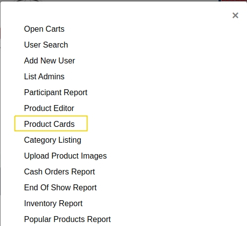
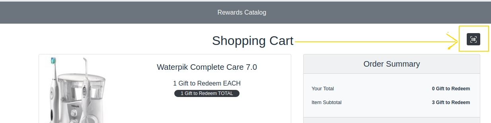
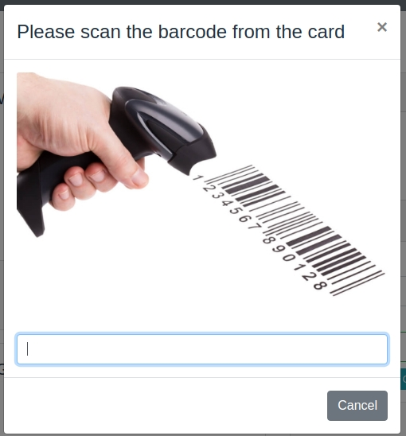

# Bar Coding - https://app.clickup.com/t/hjym05

In order of having some cards to work with, there are a "Product Cards"  menu in MasterAdmin.

## Usage 

Click in the icon in the Shopping Cart page:

A modal windows will pop up:

Using the barcode scanner, scan the barcode (from the product card).
The product will happen in the cart (or increment the quantity by 1 in the case of the product is already in the cart).

---