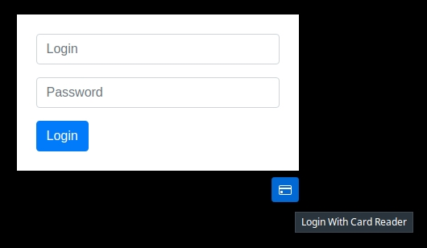

# Login With Card - https://app.clickup.com/t/hjykxu

1 - Go to the login page. (example dev: https://dev.incentashop.com)

2 - Click the button "Login With Card Reader" _(image 1)_

3 - Swip the card.

_image 1:_

# Add or Update User CardId
1 - Login with an Admin (or MasterAdmin) account.

2 - go to Admin -> User Search or (MasterAdmin -> User Search)

3 - search the user and click in "Update User/View Orders"

4 - click button "Uptade Card"

5 - Swip the card.

Note: After swip the card the update is done.

---