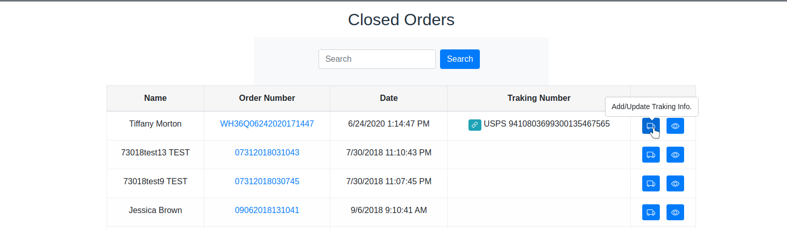
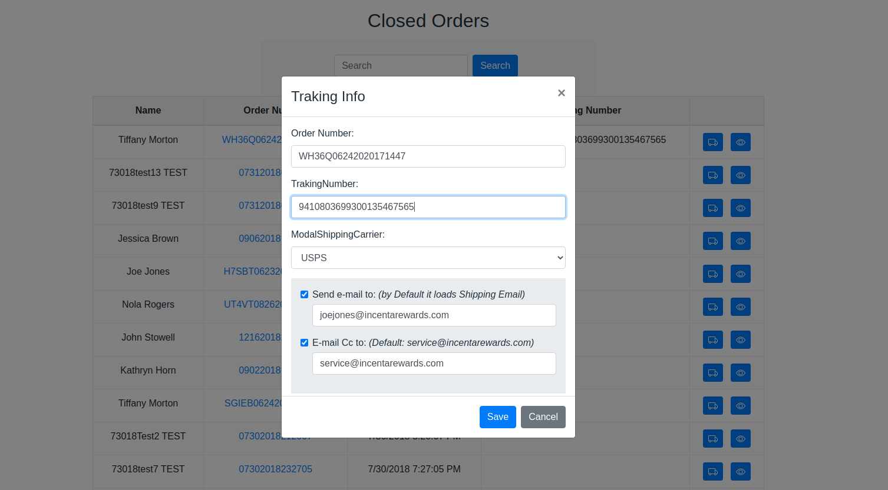
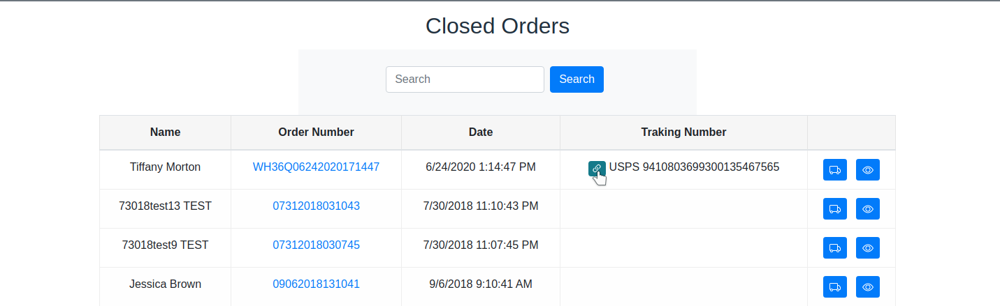
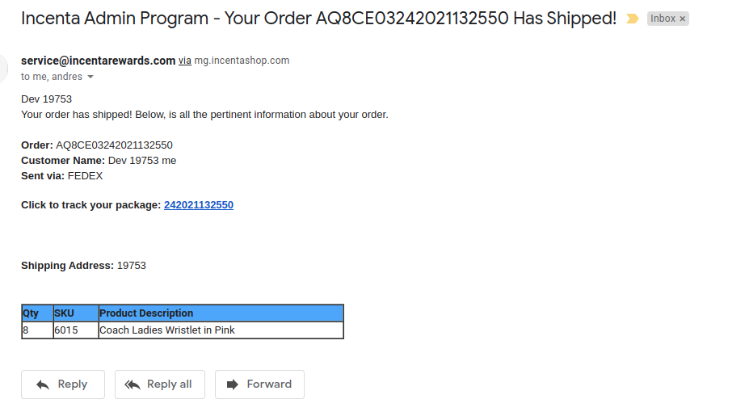
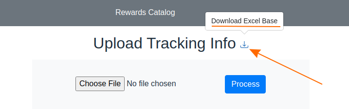
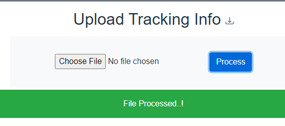

# Shipping Traking Info
## Shipping Traking Info By Order

    1 - Go to Admin/MasterAdmin > Closed Orders.(1)
    2 - Search for the an order.
    3 - Click in the icon "Add/Update Traking Info"(2)
    4 - Fill the fields Tracking Number and choose a Shipping Carrier
            Emails:
            -   "Send e-mail to" by default it loads Shipping Email, but is updateable
            -   "E-mail Cc to" by default send to service@incentarewards.com, also is updateable
    5 - Click "Save" button

## (1)

## (2)

## If the tracking number is provided you have an easy link to follow the shipping.

## E-mail

## Shipping Traking Info Bulk Upload

    1 - Go to MasterAdmin > Upload Tracking Info
    2 - Choose the Excel File.(3)
    3 - Click in the button "Process"(4)

## (3)
The base file for create the xlsx is in the following icon:

## (4)

### Notes:
    - E-mail fields are optional – if you leave the e-mail fiedl empty NO email is sent.