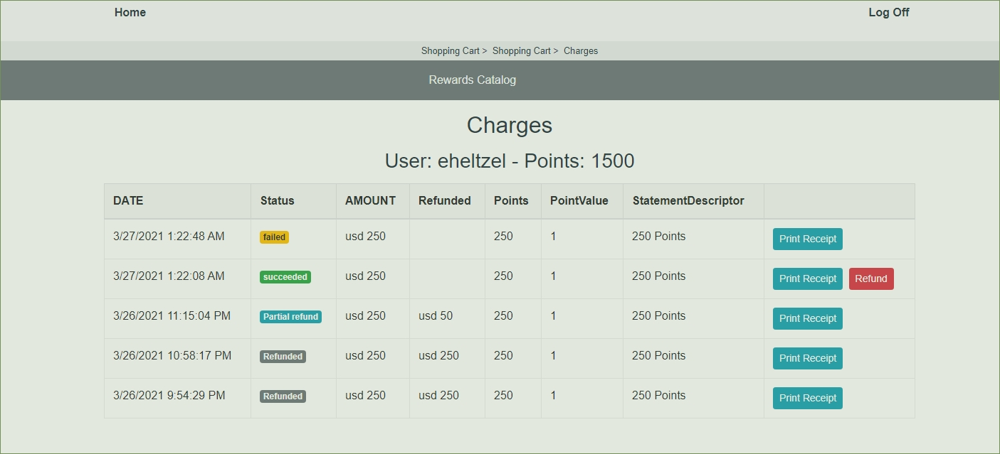

# Enable Credit Card Payments (Admin or MasterAdmin)

1 - Login with an Admin (or MasterAdmin) account.

2 - Select a Program (MasterAdmin -> Select Program)

3 - Go to Edit Program (MasterAdmin -> Edit Program)

4 - Select "Yes" in "Accept Credit Card Payments" and click in "Update Program" button

---

---

# Make a payment (As User)

    Preconditions:

        - Accept Credit Card Payments is ENABLED for the program.

        - Your cart has MORE points than available for the account.

1 - Login with an User account.

2 - Go to the cart

## Notes:

### Cards for testing:

- Payment succeeds: _4242 4242 4242 4242_

- Authentication required: _4000 0025 0000 3155_

- Payment is declined: _4000 0000 0000 9995_

#### EXP: _08 / 24_

#### CVC: _123_

#### ZIP: _94107_

---

---

# List Credit Card Payments

1 - Login with an Admin (or MasterAdmin) account.

2 - Go to Admin -> User Search or (MasterAdmin -> User Search)

3 - Search the user and click in "Stripe Charges"

# Refund a Card Payments

    Preconditions:
        - The User account have enough points
        - The Transaction status is succeeded

1 - Login with an Admin (or MasterAdmin) account.

2 - Go to Admin -> User Search or (MasterAdmin -> User Search)

3 - Search the user and click in "Stripe Charges"

4 - Click the Refund button in the desired transaction.

5 - Read and accept the confirmation popup

### Note: this operation can't be undone.
