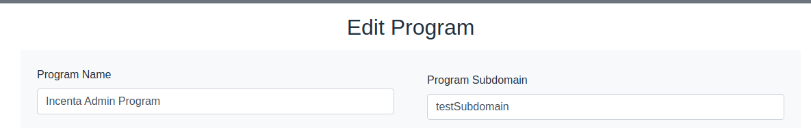

# Subdomains
In order of have subdomains, now the system has a very easy way of do it

    1 - Go to MasterAdmin > Edit Program
    2 - In the field "Program Subdomain", type the subdomain name
    3 - Click in the button "Update Program"

Done. Go to the selected subdomain:

